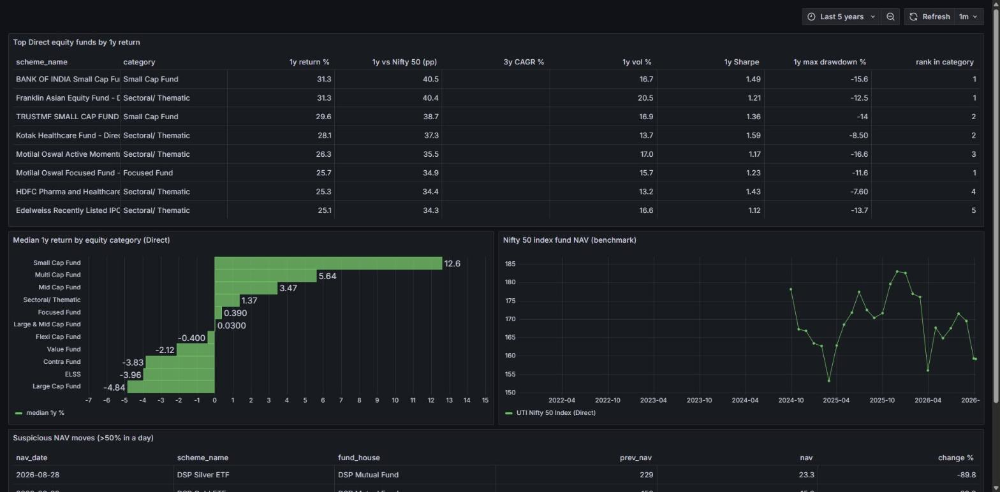
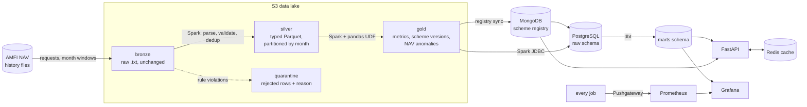
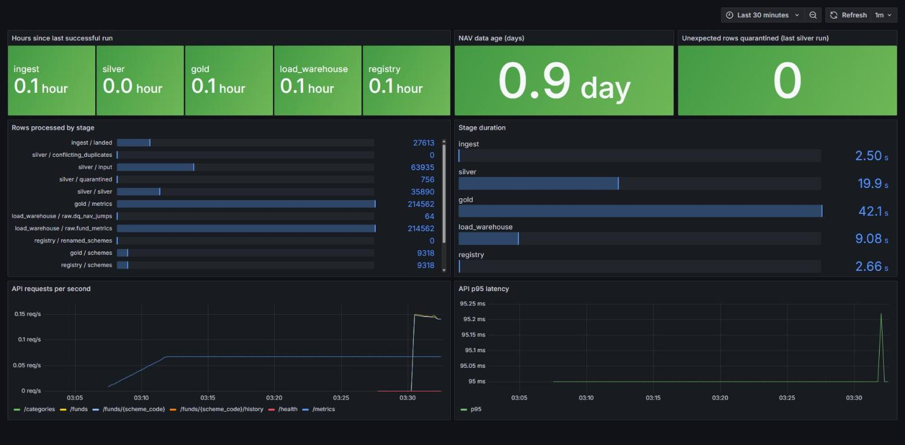

# Mutual Fund Analytics Pipeline

An end-to-end data pipeline over the **complete NAV history of every Indian mutual fund**,
published daily by AMFI (Association of Mutual Funds in India). It lands the raw files in an
S3 data lake, cleans and validates them with Spark, computes risk/return metrics per scheme,
models them with dbt in PostgreSQL, and serves them through a cached REST API, with
Airflow orchestrating everything and Prometheus/Grafana watching it.

AMFI's history goes back to April 2006: roughly **35–40 million NAV rows and 4–5 GB of raw text**,
growing by ~8,000 rows every business day.



## Architecture



Orchestrated by two Airflow DAGs:

| DAG | Schedule | What it does |
|---|---|---|
| `mf_nav_daily` | 07:00 IST | Re-fetches the last 5 days (AMFI publishes late NAVs and corrections), rebuilds the affected silver month, then gold → registry + warehouse → dbt → API cache refresh |
| `mf_nav_backfill` | manual | Loads any historical range. Splits it into **one mapped task per year** (dynamic task mapping), downloads two years at a time, runs one Spark job at a time |

## Results from a real run

Backfill of Sep 2024 → Oct 2026 on a laptop (Docker, 8 GB RAM):

| | |
|---|---|
| NAV rows parsed | 4,456,436 |
| Schemes | 9,318 |
| Month-end metric rows | 214,562 |
| Rows quarantined | 55,276 (1.24%), see below |
| End-to-end runtime | ~5.5 minutes |
| dbt models + tests | 30 / 30 passed |

The metrics were cross-checked against an independent source: the UTI Nifty 50 Index Fund's
1-year return computed by this pipeline (−9.16% as of 7 Oct 2026) matches the figure computed
from [mfapi.in](https://www.mfapi.in/) to two decimal places.

## Tech stack, and why each piece is there

| Layer | Tool | Why |
|---|---|---|
| Ingestion | Python, `requests` | AMFI serves plain text over HTTP; a custom client handles their date format, HTML error pages and retries |
| Lake storage | S3 (SeaweedFS locally), Parquet | Raw files are kept unchanged in **bronze**, so a parsing bug can be fixed and replayed without re-downloading 20 years |
| Processing | **PySpark** | Parsing and de-duplicating tens of millions of rows; partition-level overwrites |
| Per-scheme maths | **pandas / NumPy** via `applyInPandas` | Drawdown and point-in-time lookbacks are path-dependent: awkward as SQL windows, simple in NumPy once Spark groups each scheme onto one task |
| Orchestration | **Airflow** | Scheduling, retries, dynamic task mapping for backfills |
| Warehouse | **PostgreSQL** | Month-end metrics (not 40M daily rows) for analysts and the API |
| Modelling | **dbt** | Staging → marts with tests (uniqueness, relationships, custom range checks) |
| Scheme registry | **MongoDB** | Each scheme is a nested document: current name/category plus every past version. Schemes get renamed and re-categorised (SEBI's 2018 recategorisation moved almost every fund) |
| Serving | **FastAPI + Redis** | Versioned cache: the pipeline bumps a version key after each dbt build, so stale responses are never served and never need deleting |
| Monitoring | **Prometheus + Pushgateway + Grafana** | Batch jobs push row counts, durations and freshness; the API is scraped for request rate and latency |
| Delivery | **Docker Compose, GitHub Actions** | One command to run the stack; CI runs lint, unit + Spark tests, `dbt build` against real Postgres, and image builds |

## Data quality

Bad rows are never silently fixed or dropped. Every row that breaks a rule goes to the
**quarantine** zone with its reason, and the run **fails** if more than 2% of rows are
quarantined for unexpected reasons. The check runs *before* anything is written to silver.

| Rule | Example from real AMFI data |
|---|---|
| `malformed_line` | wrong number of fields |
| `non_numeric_nav` | `N.A.` for SBI US Specific Equity FoF on 14 Oct 2024 |
| `zero_nav` | segregated portfolios (see below) |
| `negative_nav`, `bad_date`, `date_outside_requested_window` | defensive |

Other checks:
- **Duplicates:** overlapping download windows are expected (the daily run re-fetches 5 days).
  The newest window wins, and *conflicting* duplicates (same scheme and date, different NAV) are counted.
- **Freshness:** the daily run fails if the newest NAV is more than 5 days old.
- **Anomalies:** day-over-day NAV moves above 50% are flagged for review in `mart_nav_anomalies`.
- **dbt tests:** uniqueness, relationships, one "latest" row per scheme, drawdown ≤ 0, volatility ≥ 0,
  and a warning for implausible returns.

**Two things the checks found in real data:**

1. **1.2% of all rows had NAV = 0.** All of them came from 153 *segregated portfolios*:
   side pockets that fund houses create to isolate defaulted bonds, written down to zero
   and still reported every day. They were first counted as errors, which would eventually
   have failed healthy runs as more side pockets appear. They now have their own
   `zero_nav` reason: still quarantined (a zero NAV breaks return maths), but excluded
   from the failure threshold.
2. **DSP Silver ETF "fell" 89.8% in one day** (₹229 → ₹23.3 on 28 Aug 2026). This is a unit
   split, not a crash. It is exactly the kind of move the anomaly mart exists to surface,
   because left unexplained it would corrupt that fund's returns.



## Metrics

Computed per scheme at every month-end and at the latest NAV:

- Returns: 1 month, 1 year, 3-year CAGR, 5-year CAGR
- Risk: annualised volatility of daily log returns (1y), maximum drawdown (1y)
- Sharpe ratio (1y), using a 6.5% risk-free rate

Marts rank Growth-option funds within their category (Direct and Regular plans separately)
and compare each against the category median and a Nifty 50 index fund benchmark.
IDCW options are excluded from rankings because their NAV drops on every payout.

Edge cases handled (each has a test): lookback dates with no NAV nearby (scheme not yet
launched or suspended) give `NULL`, not a stale number; returns spanning a gap of more than
10 days are not treated as daily returns; Sharpe is `NULL` when volatility is effectively
zero (otherwise float rounding on liquid funds produced ratios in the trillions).

## Running it

Requirements: Docker Desktop with ~8 GB memory.

```bash
cp .env.example .env
docker compose up -d --build

# Load two years of history (≈ 5 minutes)
docker compose exec airflow airflow dags unpause mf_nav_backfill
docker compose exec airflow airflow dags trigger mf_nav_backfill \
    --conf '{"start_date": "2024-09-01", "end_date": "2026-10-08"}'
```

| Service | URL | Login (local defaults) |
|---|---|---|
| Airflow | http://localhost:8080 | admin / admin |
| API docs | http://localhost:8000/docs | n/a |
| Grafana | http://localhost:3000 | admin / admin |
| Prometheus | http://localhost:9090 | n/a |

Example API calls:

```bash
curl "localhost:8000/funds?category=Equity%20Scheme%20-%20Large%20Cap%20Fund&plan=Direct&limit=5"
curl "localhost:8000/funds/120716"            # scorecard + full rename history from MongoDB
curl "localhost:8000/funds/120716/history?months=12"
curl "localhost:8000/categories"
```

Each job also runs on its own, outside Airflow:

```bash
docker compose exec airflow python -m mfpipeline.ingest.cli --start 2026-09-01 --end 2026-09-30
docker compose exec airflow python -m mfpipeline.jobs.silver --periods 2026-09
docker compose exec airflow python -m mfpipeline.jobs.gold --skip-freshness-check
```

## Tests

```bash
docker compose exec airflow python -m pytest tests      # parser, ingestion, Spark jobs, metrics, registry
```

39 tests, including Spark tests on a fixture file that packs every failure mode found in the
real data (`N.A.` NAVs, zero NAVs, malformed rows, impossible dates, conflicting duplicates
across overlapping windows). The API tests run with fakes for Postgres and Redis.

## Project layout

```
dags/                     Airflow DAGs (daily + backfill)
src/mfpipeline/
  ingest/                 AMFI client -> bronze
  parse.py                stateful parser for AMFI's text format
  jobs/silver.py          bronze -> silver (Spark): typing, validation, quarantine, dedup
  jobs/gold.py            silver -> gold (Spark + applyInPandas)
  analytics.py            per-scheme metrics (NumPy)
  jobs/load_warehouse.py  gold -> Postgres (Spark JDBC)
  registry/               gold -> MongoDB -> Postgres scheme registry
  quality/checks.py       quarantine rules, thresholds, freshness
  api/                    FastAPI app, repository, versioned Redis cache
dbt/                      staging + marts models, generic and singular tests
monitoring/               Prometheus config, provisioned Grafana dashboards
docs/design.md            design decisions and scaling notes
```

## What I would change for production

- **Spark on a cluster** (EMR / Dataproc / Databricks) via `SparkSubmitOperator`; here Spark runs
  in local mode inside the Airflow container.
- **Incremental gold:** recompute metrics only for schemes with new NAVs, using a 5-year lookback
  window, instead of the full history every run.
- **Table format:** Delta Lake or Iceberg for silver, for atomic commits and time travel instead of
  dynamic partition overwrite.
- **Secrets** from a vault instead of `.env`; a managed Postgres; Airflow on Kubernetes with the
  Celery or Kubernetes executor.
- **Alerting** rules in Prometheus (stale data, failed runs) routed to Slack or PagerDuty.

See [docs/design.md](docs/design.md) for the reasoning behind the main decisions.

## Data source

NAV data © AMFI, published at [amfiindia.com](https://www.amfiindia.com/). This project is for
learning and demonstration; nothing here is investment advice.
